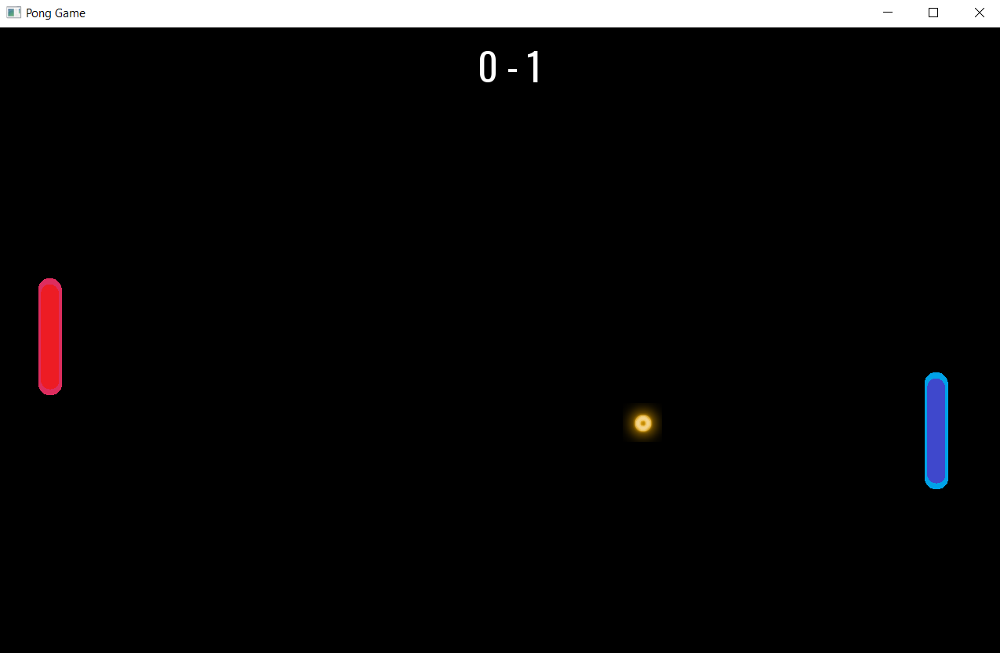

# Pong Game

### A simple Pong Game made with C++ and SFML for the GUI.

## Play the Game

To play the game go to **./Pong_Game/bin/Release** folder then open **Pong_Game.exe**.

## Game Controllers

To move the Pad up press the **W** key and to move it down press the **S** Key.

## Game modes

Right now there is one mode which is single player mode **(vs AI)**.

## Game Preview

